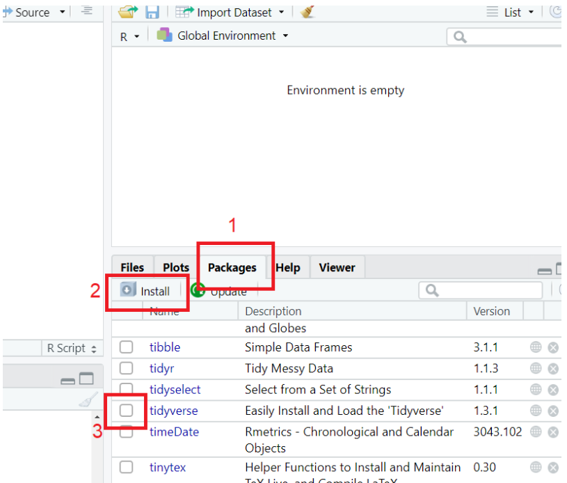

```{r setup, include=FALSE}
knitr::opts_chunk$set(echo = TRUE)
```


```{r, echo=FALSE}
htmltools::img(src = knitr::image_uri("../gfx/ntu.png"), 
               alt = 'logo', 
               style = 'position:absolute; top:0; right:0; padding:10px;',
               width = "350px",
               heigth = "350px")
```

---

# Downloading and installing R and RStudio

Attendees should make sure they have a computer / laptop that is compatible with R and RStudio. Both these software packages need to be installed. R is the backend language and RStudio is the graphical user interface. You will not need to open R. **We will only work in RStudio.** Avoid using machines that you don't have full admin right for (e.g. university machines).


* R can be downloaded [here](https://www.stats.bris.ac.uk/R/). Make sure you download the latest version compatible with your operating system.
* RStudio can be download [here](https://www.rstudio.com/products/rstudio/download/#download).

Download installation files for both programmes and follow the installation instructions using default settings.


If you can't install either on your machine, there is also a browser based version called RStudio Cloud. You will need to sign up an account to use [RStudio Cloud](https://login.rstudio.cloud/login). This is useful if there are problems with the installation but there are restrictions that limit the RStudio experience. Therefore, we recommend, in the first instance, to work on RStudio locally.


# Installing packages (aka libraries)

**Attendees should make sure their version or RStudio and R are operating correctly before the workshop.** The best way to check that everything is operating is to install and then load a package. R is equipped with many built-in functions such as `t.test` or `mean` and this is what we call "base R function". However, we can also add other functions for doing tasks that are not easily or at all possible with base R functions. These functions come from external packages. As such, we have to install and download these packages in RStudio.

Here are two ways you can install a package. We will install and load the package `tidyverse` which we will use a lot.


## RStudio's GUI

::: {.floatting}

```{r out.width='40%', out.extra='style="float:right; padding:10px"', echo = F}

```

The first option is to use RStudio's user interface. See screenshot. 

1. Open RStudio. Locate and click on the tab on the panel on the right that is called "Packages" in RStudio.
2. Click on Install. In the Packages box, begin to type in *tidyverse*. You will see the package listed. Install this package. You should see on the console text similar to "package ‘tidyverse’ successfully unpacked and MD5 sums checked".
3. You must also load to package so that it is ready for use. Within the list of packages on the
right-hand panel, scroll until you see `tidyverse`. Click on the check box next to `tidyverse`. This will
then load the package.


:::

## Command line

Alternatively you can use RStudio's command line to install and load the package `tidyverse`. Note, there is no need to install `tidyverse` again if you followed the steps above.

Make sure you locate the **Console** panel in RStudio (by default it is located on the left). In the console, type the following command and hit the Enter key to install `tidyverse`. Don't forget the inverted commas.

```{r eval = F}
install.packages("tidyverse")
```


This will run the installation for you. Again, you only need to install the package once. 

After the installation is completed, use the `library`() function to load the package `tidyverse`. Again, type the command below into the console and hit Enter.

```{r eval = F}
library(tidyverse)
```


Please contact us prior to the workshop if you encounter any difficulties in the steps above. Warning messages are usually okay, but if there are “error” messages that you cannot solve, please do get in touch and we will aim to support prior to the workshop.


